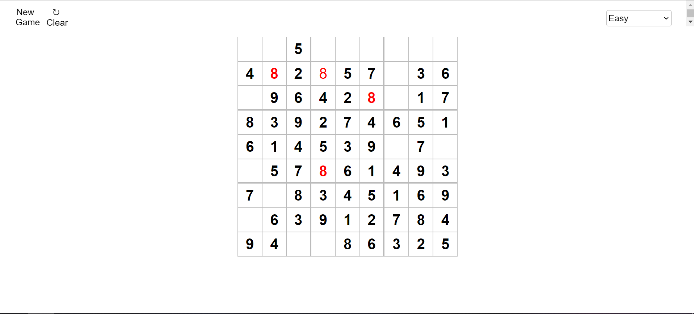
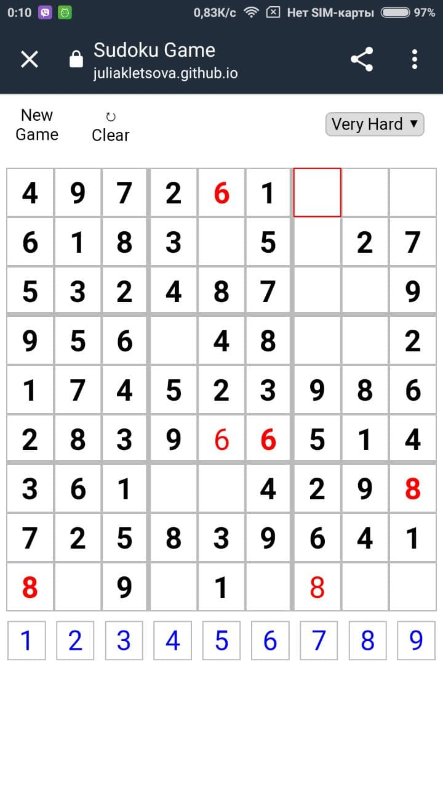

# sudoku

A small funny Sudoku game with different difficulty levels. This project was not thought out as it follows, so don't be so serious about styles)))
[Here](https://juliakletsova.github.io/sudoku/) is a link to watch it.

## Notebook preview


## Android smartphone preview


## Project setup
```
npm install
```

### Compiles and hot-reloads for development
```
npm run serve
```

### Compiles and minifies for production
```
npm run build
```

### Lints and fixes files
```
npm run lint
```

### Customize configuration
See [Configuration Reference](https://cli.vuejs.org/config/).
